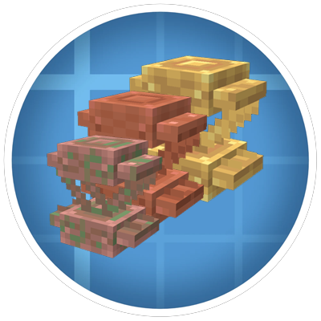
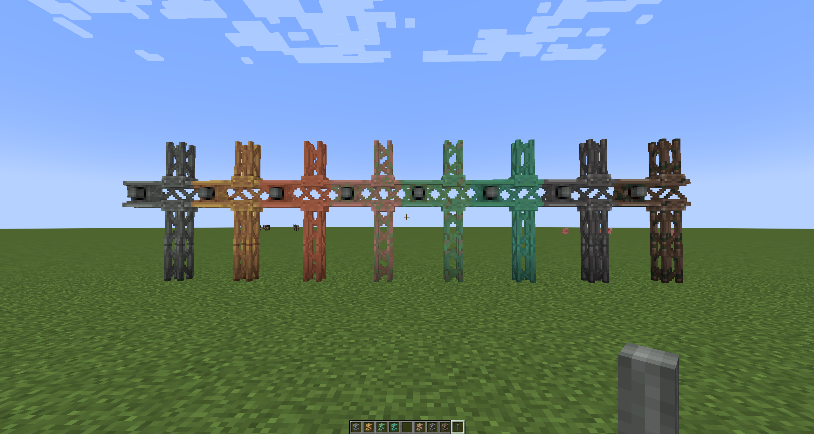

# Create: More Girder

### 🏗️ *Expand your Create builds with beautiful structural girders!* 🏗️

*A comprehensive NeoForge mod that brings an extensive collection of girder variants to enhance your Create mod building experience.*

---

## ✨ **Features**

**Create: More Girder** revolutionizes your structural building possibilities by adding **9 unique girder variants** and a full **girder strut system** to complement the Create mod ecosystem. Each girder type offers distinctive aesthetics while maintaining full compatibility with Create's mechanical systems.

### 🎨 **Available Girder Variants**

| Girder Type | Description | Special Properties |
|-------------|-------------|-------------------|
| 🗿 **Andesite Girder** | The foundation variant from Create: Diesel Generators | Classic industrial look |
| 🥉 **Brass Girder** | Elegant brass construction | Premium mechanical aesthetics |
| 🟠 **Copper Girder** | Fresh copper with natural shine | Weathers over time |
| 🟤 **Exposed Copper Girder** | Slightly weathered copper | Natural aging process |
| 🟫 **Weathered Copper Girder** | Well-aged copper patina | Advanced weathering stage |
| 🟢 **Oxidized Copper Girder** | Fully oxidized copper | Final weathering stage |
| ⚙️ **Industrial Iron Girder** | Heavy-duty iron construction | Maximum durability |
| 🔶 **Weathered Iron Girder** | Time-worn iron girders | Rustic industrial charm |
| 🎭 **Copycat Girder** | Mimics any block's texture | Blends into any build style |

### 🏗️ **Girder Strut System**

Bridge the gap between girder columns with structural struts that span up to **30 blocks**:

- **Girder Struts**: Connect two girder anchors with a dynamic beam — material cost scales with length
- **Copycat Struts**: Same functionality as regular struts but mimic any block's texture for seamless integration
- **Contraption Compatible**: Struts assemble onto Create contraptions (bearings, pistons, cart assemblers) and move with the structure
- **Placement Cost Overlay**: An on-screen overlay shows the exact material cost before you commit the placement
- **Anchor Helper**: When aiming at a strut's start anchor, a visual indicator shows the valid endpoint

### 🔧 **Mechanical Integration**

- **Full Create Compatibility**: All girders work seamlessly with Create's kinetic systems
- **Encased Shaft Variants**: Every girder type includes encased shaft functionality
- **Rotational Power**: Transfer mechanical energy through any girder structure
- **Track Paving**: Use CMG girders to pave rails under both straight and curved Create track sections
- **Wrench Helpers**: All girder variants support wrench rotation blockstate helpers

### 🌟 **Advanced Features**

- **📦 Waxed Variants**: Preserve copper girders at any weathering stage with honeycomb
- **🔄 Natural Weathering**: Copper girders age realistically over time
- **⚡ Axe Interaction**: Scrape copper girders to reverse weathering
- **🎯 Smart Placement**: Context-aware girder placement system

---

## 🚀 **Installation**

### **Requirements**
-  **Minecraft 1.21.1**
-  **NeoForge 21.1.209+**
-  **Create 6.0.0+**

### **Installation Steps**
1. Install NeoForge for Minecraft 1.21.1
2. Download and install the Create mod
3. Download Create: More Girder from CurseForge or Modrinth
4. Place the mod file in your `mods` folder
5. Launch and enjoy building!

---

## 🎮 **Usage**

Create: More Girder seamlessly integrates into your Create builds. Simply craft any girder variant and start building! The mod includes:

- **🔨 Crafting Recipes**: Intuitive recipes for all girder types
- **📚 JEI Integration**: Full recipe and usage information
- **🎯 Placement System**: Smart girder connection and alignment
- **⚙️ Kinetic Support**: All girders work with Create's rotational systems

---

## 🤝 **Compatibility**

**Create: More Girder** is designed to work perfectly with:
- ✅ **Create** and all official Create addons
- ✅ **Create: Diesel Generators** (shares andesite girder foundation)
- ✅ **Create: Enchantment Industry**
- ✅ **Create Aeronautics** (girders and struts registered as Sable light blocks)

---

## 🎨 **Credits & Attribution**

### **Development**
- **👨‍💻 Agent772** - Lead Developer & Project Maintainer

### **Art & Design**
- **🎨 swyt** - textures and visual assets

### **Technical Foundation**
- **⚙️ jesz** - Original andesite girder implementation (Create: Diesel Generators)
- **🏗️ Industrialists-Of-Create** - Girder strut system adapted from [Bits-n-Bobs](https://github.com/Industrialists-Of-Create/Bits-n-Bobs) (MIT License)
- **🏗️ Create Team** - Core mod framework and kinetic systems

---

## 📜 **License**

This project is licensed under the **MIT License**, promoting open-source collaboration and modification.

**Code Attribution**: 
- Incorporates girder design patterns from Create: Diesel Generators (MIT Licensed) by jesz
- Girder strut system adapted from Bits-n-Bobs by Industrialists-Of-Create (MIT Licensed): https://github.com/Industrialists-Of-Create/Bits-n-Bobs

---

### 🌟 **Support the Project** 🌟

If you enjoy **Create: More Girder**, consider:
- ⭐ Starring this repository
- 🐛 Reporting bugs or suggesting features
- 📢 Sharing with the Create community
- 💝 Supporting the developers

**Happy Building!** 🏗️✨

